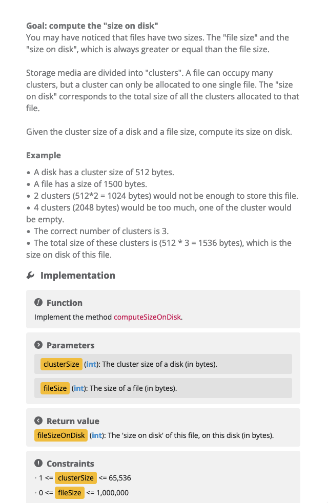

<h1 align = "center"> INTERNSHIP TASKS </h1>
This repository is used to solve the tasks assigned to me during the internship program "BearingPoint - ULBS 2023".

> ## Task 1

  
Disk Size

  
Example

<video src="disk-size/test.mp4" controls title="disk-size"></video>

> ## Task 2

  
Combat System

  
Example

<video src="combat-system/res/test.mp4" controls title="Combat System"></video>

